# Enterprise Network Architecture

> A multi-site Cisco Packet Tracer enterprise network simulation demonstrating routed campus connectivity, resilient Layer 2/Layer 3 design, centralized services, and practical access controls.

## Project Overview

This project models an enterprise network that connects a headquarters (HQ), an Engineering campus, and a Remote Campus through an ISP-facing WAN. The simulation is built in Cisco Packet Tracer and is intended as a portfolio project for CCNA-level networking, switching, routing, services, and security concepts.

The repository contains the complete Packet Tracer project and organized verification screenshots. The screenshots were renamed for clarity only; their contents have not been altered.

## Network Architecture

The topology uses a hierarchical campus design at each site, with access switches connected to redundant core or distribution switches. The HQ site also contains a data-center segment that hosts the DHCP, DNS, and database services shown in the topology. Router links interconnect the Remote Campus, HQ, Engineering campus, and ISP.

Key design elements visible in the project include:

- **HQ, Engineering, and Remote Campus** user networks, each with dedicated VLANs and access-layer connectivity.
- **Redundant HQ core and Engineering distribution pairs** that provide Layer 3 gateways for user VLANs.
- **WAN/edge routing** between sites and the ISP.
- **Data-center services** at HQ, including DHCP, DNS, and a database server at `10.10.60.20`.
- **Wireless endpoints** shown at each campus through access points and wireless clients.

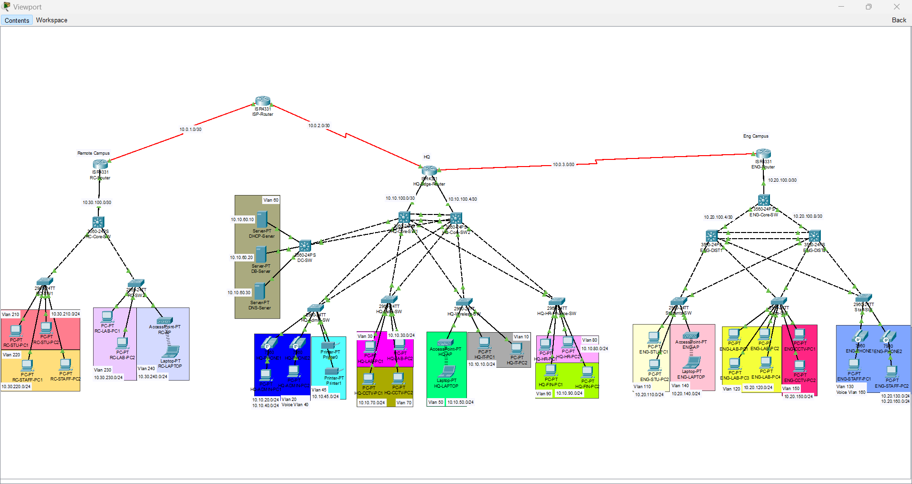

*Complete enterprise topology: Remote Campus, HQ, Engineering campus, ISP connectivity, user VLANs, access points, and HQ services.*

## Cisco Packet Tracer

Open [`Abdelrahman-Enterprise-Network.pkt`](Abdelrahman-Enterprise-Network.pkt) in Cisco Packet Tracer to explore the simulated devices, links, addressing, and configurations. The Packet Tracer project is preserved as the source-of-truth simulation artifact and is not modified by this documentation work.

Suggested checks in Packet Tracer:

1. Inspect device interfaces and routing tables with `show ip route`.
2. Review VLAN/SVI status with `show vlan brief` and `show ip interface brief`.
3. Verify first-hop redundancy with `show standby brief`.
4. Review LACP, spanning tree, DHCP snooping, port security, and ACL output using the documented screenshots as a guide.

## Routing and WAN Connectivity

### Routing Protocols

The verification output documents the following dynamic-routing behavior:

| Protocol | Evidence in the project |
| --- | --- |
| **OSPF** | `O` and `O E2` routes are shown in the routing tables. |
| **EIGRP** | `D` and `D EX` routes are shown in the routing tables. |
| **eBGP** | `B` routes are shown on the Remote Campus and ISP routing tables. |

### Route Redistribution

The routing tables show both OSPF external type-2 (`O E2`) and EIGRP external (`D EX`) entries. This is evidence of redistributed routes being exchanged between routing domains; the README intentionally does not infer unshown redistribution commands or metrics.

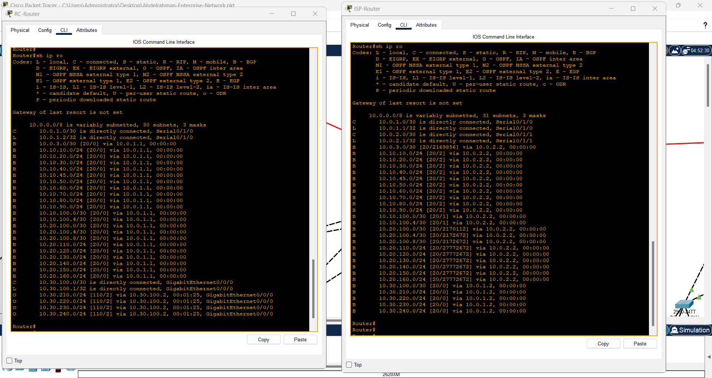

*Remote Campus and ISP routing tables showing BGP-learned routes.*

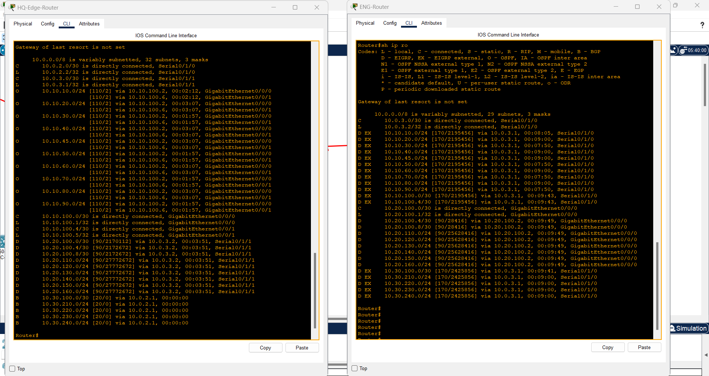

*HQ Edge and Engineering routing tables showing OSPF and EIGRP/EIGRP-external route entries.*

## Switching and High Availability

### SVI and Inter-VLAN Routing

The HQ core, Engineering distribution, and Remote Campus core switches show active switch virtual interfaces (SVIs) for their local VLANs. These Layer 3 SVIs provide the inter-VLAN gateways for end devices.

### VLANs and VLAN Segmentation

The topology and switch output show functional segmentation for groups such as IT, administration, labs, voice, printers, Wi-Fi, servers, CCTV, HR, finance, students, and staff. Examples include:

- **HQ:** VLANs 10–90, including the HR VLAN 80 and Server VLAN 60.
- **Engineering:** VLANs 110–160 for students, lab, staff, Wi-Fi, CCTV, and phones.
- **Remote Campus:** VLANs 210–240 for students, staff, lab, and Wi-Fi.

### HSRP

`show standby brief` output documents active/standby HSRP roles and virtual gateway addresses on the redundant HQ core and Engineering distribution switch pairs. HSRP provides a resilient default gateway for the associated VLANs.

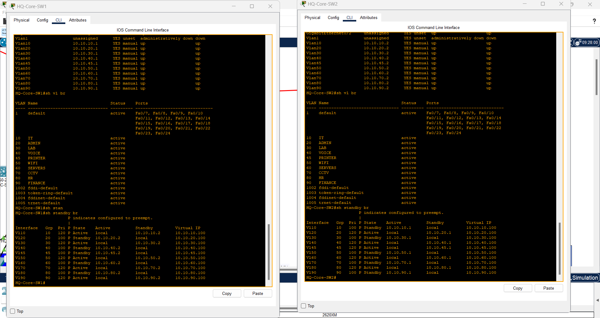

*HQ core switches: SVI addressing, VLAN definitions, and HSRP active/standby state.*

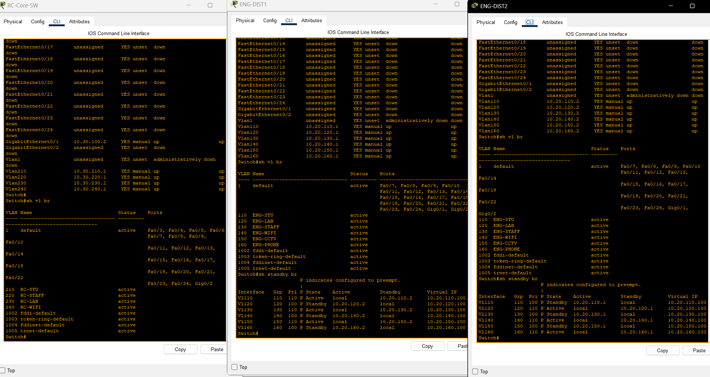

*Remote Campus and Engineering switching output: local SVIs, VLANs, and first-hop redundancy.*

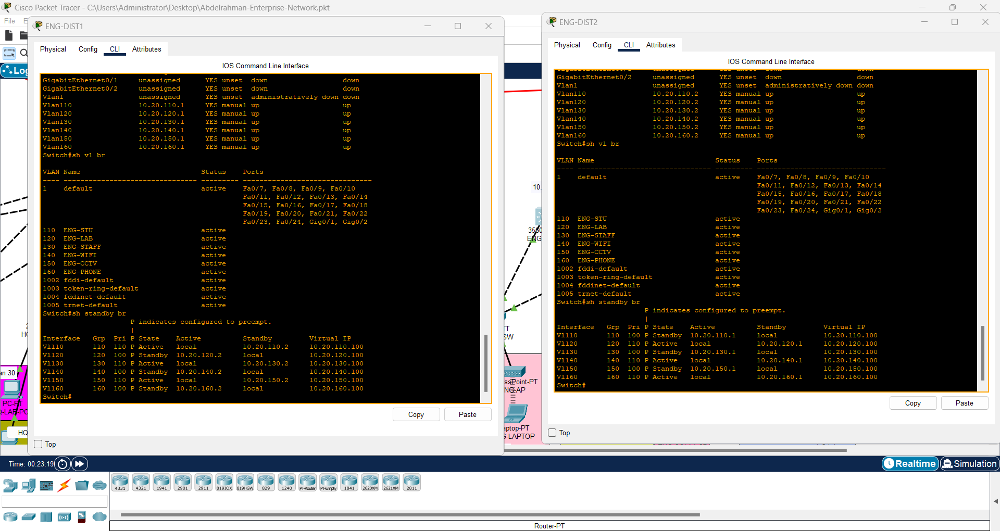

*Engineering distribution pair: VLANs, SVIs, and complementary HSRP states.*

### EtherChannel / LACP

The EtherChannel verification shows Port-channel 1 operating with **LACP** and carrying trunk VLANs. Bundled links improve bandwidth and preserve connectivity if an individual member link fails.

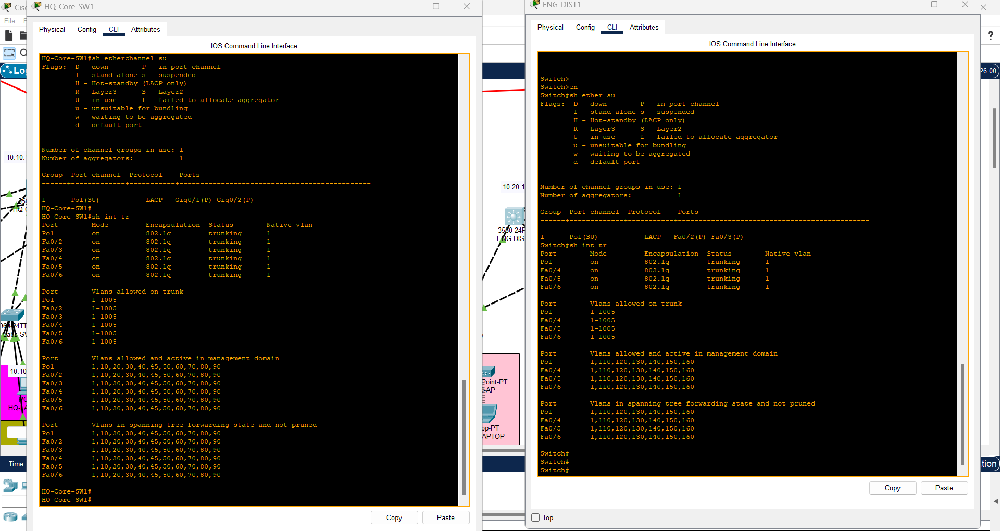

*LACP EtherChannel summary and 802.1Q trunk status at the HQ core and Engineering distribution layer.*

### Rapid-PVST+

Switch output identifies the spanning-tree mode as **rapid-pvst**. Rapid-PVST+ provides per-VLAN loop prevention and faster convergence for the redundant switched topology.

## Services

### DHCP

The HQ DHCP server shows pools for the campus VLANs, and endpoint screens show clients receiving addresses, default gateways, and DNS settings through DHCP.

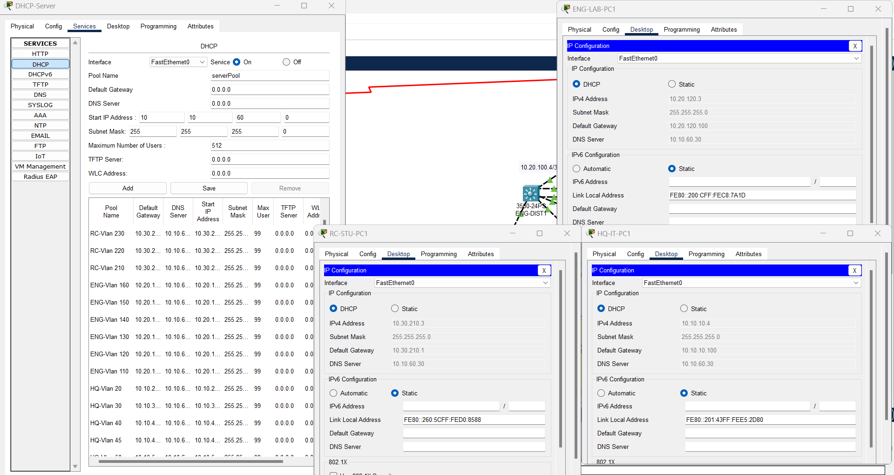

*DHCP pool inventory with clients in HQ, Engineering, and Remote Campus configured by DHCP.*

### DNS and End-to-End Connectivity

Connectivity tests show successful name resolution for `university.local` and successful inter-campus pings from representative endpoints.

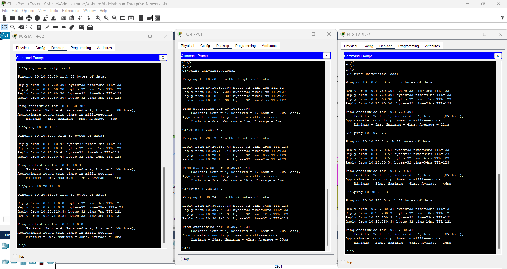

*Name-resolution and cross-campus ping validation from Remote Campus, HQ, and Engineering endpoints.*

### Wireless Networking

The logical topology contains access points and wireless clients at HQ, Engineering, and the Remote Campus. This repository documents their presence in the simulation; it does not claim wireless security settings that are not visible in the available evidence.

## Network Security

### ACLs and Traffic Filtering

The extended `DB-ACCESS` ACL is documented on the HQ core switches. The policy is deliberately scoped to the database server:

```text
10 permit ip 10.10.80.0 0.0.0.255 host 10.10.60.20
20 deny ip any host 10.10.60.20
30 permit ip any any
```

This permits the **HR subnet (VLAN 80, `10.10.80.0/24`)** to reach the database server at **`10.10.60.20`**, denies all other sources to that host, and permits other traffic. The validation screenshot shows an HR endpoint reaching the database server while a Finance endpoint is unable to do so.

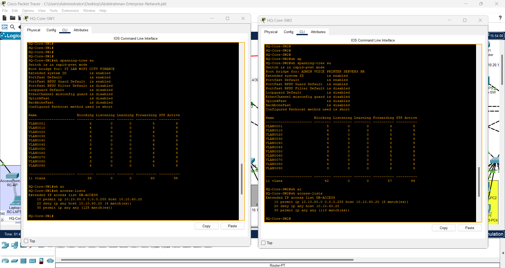

*`DB-ACCESS` ACL output on the HQ core pair, including the HR-only database-server policy.*

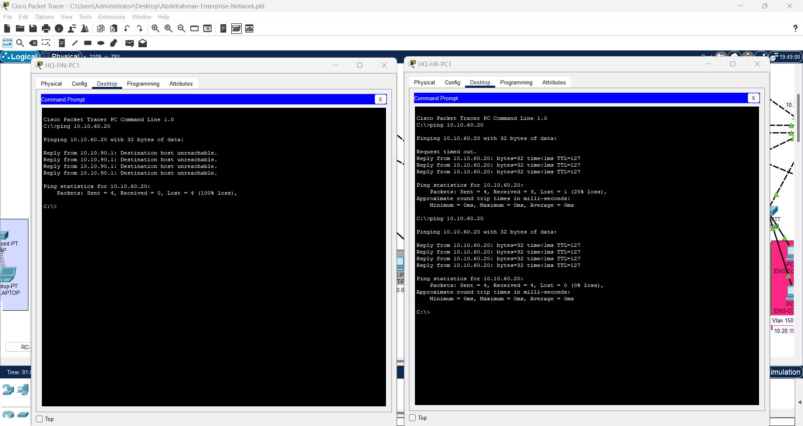

*Connectivity validation: HR traffic reaches the database server while Finance traffic is blocked.*

### DHCP Snooping and Port Security

Switch output documents DHCP snooping bindings and port-security enforcement on access interfaces. Together, these controls help limit unauthorized DHCP behavior and restrict endpoint access at the switch port.

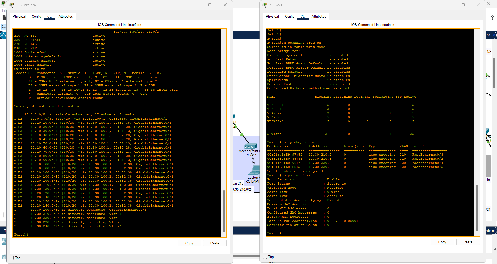

*Remote Campus verification: Rapid-PVST+ mode, DHCP snooping bindings, and port-security status.*

## Network Redundancy and High Availability

The design combines multiple resilience mechanisms:

- **HSRP** on the HQ core and Engineering distribution pairs for redundant VLAN gateways.
- **LACP EtherChannel** on inter-switch uplinks for link aggregation and member-link resilience.
- **Rapid-PVST+** to prevent Layer 2 loops and reconverge quickly when topology changes.
- **Multiple core/distribution paths** visible in the physical topology.

## Technologies / Protocols

| Area | Technologies and protocols evidenced in this project |
| --- | --- |
| Simulation | Cisco Packet Tracer |
| Dynamic routing | OSPF, EIGRP, eBGP, route redistribution evidence |
| First-hop resilience | HSRP |
| Layer 2 switching | VLANs, SVIs, 802.1Q trunks, EtherChannel/LACP, Rapid-PVST+ |
| IP services | DHCP, DNS |
| Access security | Extended ACLs, DHCP snooping, port security |
| Wireless | Access points and wireless endpoints in the topology |

## Project Structure

```text
Enterprise-Network-Architecture/
├── Abdelrahman-Enterprise-Network.pkt
├── README.md
└── screenshots/
    ├── topology/
    │   └── enterprise-network-topology.png
    ├── routing/
    │   ├── ebgp-routing-tables-rc-and-isp.png
    │   └── ospf-and-eigrp-routing-tables.png
    ├── switching/
    │   ├── campus-svis-vlans-and-hsrp-status.png
    │   ├── engineering-distribution-svis-vlans-and-hsrp-status.png
    │   ├── hq-core-svis-vlans-and-hsrp-status.png
    │   └── lacp-etherchannel-and-trunk-status.png
    ├── security/
    │   ├── db-server-access-acl-policy.png
    │   ├── db-server-acl-validation.png
    │   └── rapid-pvst-dhcp-snooping-and-port-security.png
    └── services/
        ├── dhcp-pools-and-client-addressing.png
        └── dns-and-intercampus-connectivity.png
```

## Screenshots

| Category | Screenshot | What it documents |
| --- | --- | --- |
| Topology | [Enterprise topology](screenshots/topology/enterprise-network-topology.png) | Complete multi-site logical design, user segments, services, and wireless components. |
| Routing | [eBGP routing tables](screenshots/routing/ebgp-routing-tables-rc-and-isp.png) | BGP route learning between Remote Campus and ISP. |
| Routing | [OSPF and EIGRP routing tables](screenshots/routing/ospf-and-eigrp-routing-tables.png) | OSPF and EIGRP/EIGRP-external entries. |
| Switching | [HQ SVI/VLAN/HSRP](screenshots/switching/hq-core-svis-vlans-and-hsrp-status.png) | HQ gateway SVIs, VLANs, and HSRP roles. |
| Switching | [Campus SVI/VLAN/HSRP](screenshots/switching/campus-svis-vlans-and-hsrp-status.png) | Remote Campus and Engineering switching verification. |
| Switching | [Engineering SVI/VLAN/HSRP](screenshots/switching/engineering-distribution-svis-vlans-and-hsrp-status.png) | Engineering distribution gateway redundancy. |
| Switching | [LACP EtherChannel](screenshots/switching/lacp-etherchannel-and-trunk-status.png) | Port-channel and trunk operation. |
| Security | [Rapid-PVST+, DHCP snooping, and port security](screenshots/security/rapid-pvst-dhcp-snooping-and-port-security.png) | Layer 2 resilience and access-port security controls. |
| Security | [DB ACL policy](screenshots/security/db-server-access-acl-policy.png) | HR-only access to the database server. |
| Security | [DB ACL validation](screenshots/security/db-server-acl-validation.png) | Allowed HR and denied Finance traffic. |
| Services | [DHCP pools and clients](screenshots/services/dhcp-pools-and-client-addressing.png) | DHCP scope and endpoint lease evidence. |
| Services | [DNS and connectivity](screenshots/services/dns-and-intercampus-connectivity.png) | Name resolution and cross-campus reachability. |

---

This README documents only technologies and outcomes visible in the Packet Tracer project inventory and the included verification screenshots.
